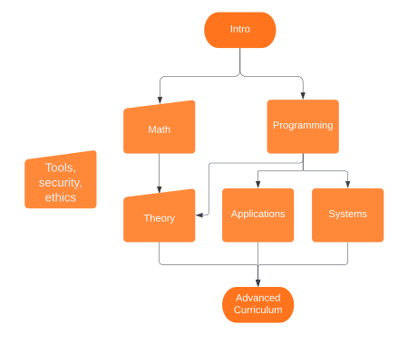

# My OSSU Computer Science

This repository is a way for me to organize my progress and plan.

The [OSSU curriculum](https://github.com/ossu/computer-science) is a complete and self-paced education in computer science that adheres to the [degree requirements](https://www.acm.org/binaries/content/assets/education/cs2013_web_final.pdf) of an undergraduate computer science major. The curriculum uses course materials from major universities worldwide such as MIT, Stanford, The University of British Columbia, UC Davis, and the Hebrew University of Jerusalem.

## Deviations from the OSSU curriculum

| Addition/Removal | Course | Reason |
| :--------------: | :----: | :----: |
|Removal| [Python for Everybody](https://www.py4e.com/lessons) | Previous experience with programming languages and some fundamentals. |
| Removal | [Calculus 1A: Differentiation](https://openlearninglibrary.mit.edu/courses/course-v1:MITx+18.01.1x+2T2019/about) | Received high marks in my university's calculus course, very comfortable with differentiation. |
| Removal | [Introduction to Intellectual Property](https://www.coursera.org/learn/introduction-intellectual-property) | Received high marks in my university's business law class which covered this subject. |
| Removal | [Introduction to Computer Science and Programming using Python](https://www.edx.org/course/introduction-to-computer-science-and-programming-7) | Replaced with Harvard's CS50. |
| Addition | [CS50's Introduction to Computer Science from Harvard](https://cs50.harvard.edu/x/2022/) | Very popular and challenging course. Regarded as one of the best introductory courses in computer science. |
| Removal | [How to Code - Complex Data](https://www.edx.org/course/how-to-code-complex-data) | Deemed redundant after taking the previous "How to Code" given my prior experience. |

## Courses

### Introduction

**Course Name**|**Prereq**|**Institution**|**Date Started**|**Date Completed**
:-----:|:-----:|:-----:|:-----:|:-----:
[CS50's Introduction to Computer Science](https://www.edx.org/course/introduction-computer-science-harvardx-cs50x?index=product&queryID=eb2236b5f632409f7c049607e9477395&position=1) (until web section) |high school math|Harvard|March 2022| May 2022

### Core programming

**Course Name**|**Prereq**|**Institution**|**Date Started**|**Date Completed**
:-----:|:-----:|:-----:|:-----:|:-----:
[How to Code - Simple Data](https://www.edx.org/course/how-to-code-simple-data)|intro section|The University of British Columbia|June 2022|June 2022
[Programming Languages, Part A](https://www.coursera.org/learn/programming-languages)|prev in section|University of Washington|July 2022|July 2022
[Programming Languages, Part B](https://www.coursera.org/learn/programming-languages-part-b)|prev in section|University of Washington|July 2022|August 2022
[Programming Languages, Part C](https://www.coursera.org/learn/programming-languages-part-c)|prev in section|University of Washington|August 2022|September 2022
[Object-Oriented Design](https://www.coursera.org/learn/object-oriented-design)|prev in section + Basic Java|University of Alberta|September 2022|September 2022
[Design Patterns](https://www.coursera.org/learn/design-patterns)|prev in section|University of Alberta|September 2022|October 2022
[Software Architecture](https://www.coursera.org/learn/software-architecture)|prev in section|University of Alberta|-|-

### Core math

**Course Name**|**Prereq**|**Institution**|**Date Started**|**Date Completed**
:-----:|:-----:|:-----:|:-----:|:-----:
[Calculus 1B: Integration](https://openlearninglibrary.mit.edu/courses/course-v1:MITx+18.01.2x+3T2019/about)|Calculus differentiation|MIT|-|-
[Calculus 1C: Coordinate Systems & Infinite Series](https://openlearninglibrary.mit.edu/courses/course-v1:MITx+18.01.3x+1T2020/about)|prev in section|MIT|-|-
[Mathematics for Computer Science](https://openlearninglibrary.mit.edu/courses/course-v1:OCW+6.042J+2T2019/about) ([alt](https://ocw.mit.edu/courses/electrical-engineering-and-computer-science/6-042j-mathematics-for-computer-science-spring-2015/index.htm))|prev in section|MIT|-|-

### Core theory

**Course Name**|**Prereq**|**Institution**|**Date Started**|**Date Completed**
:-----:|:-----:|:-----:|:-----:|:-----:
[Divide and Conquer, Sorting and Searching, and Randomized Algorithms](https://www.coursera.org/learn/algorithms-divide-conquer)|Math section, programming section|Stanford|-|-
[Graph Search, Shortest Paths, and Data Structures](https://www.coursera.org/learn/algorithms-graphs-data-structures)|prev in section|Stanford|-|-
[Greedy Algorithms, Minimum Spanning Trees, and Dynamic Programming](https://www.coursera.org/learn/algorithms-greedy)|prev in section|Stanford|-|-
[Shortest Paths Revisited, NP-Complete Problems and What To Do About Them](https://www.coursera.org/learn/algorithms-npcomplete)|prev in section|Stanford|-|-

### Core applications

**Course Name**|**Prereq**|**Institution**|**Date Started**|**Date Completed**
:-----:|:-----:|:-----:|:-----:|:-----:
[Databases: Modeling and Theory](https://www.edx.org/course/modeling-and-theory)|programming section|Stanford|-|-
[Databases: Relational Databases and SQL](https://www.edx.org/course/databases-5-sql)|programming section|Stanford|-|-
[Databases: Semistructured Data](https://www.edx.org/course/semistructured-data)|programming section|Stanford|-|-
[Machine Learning](https://www.coursera.org/learn/machine-learning)|linear algebra basics|Stanford|-|-
[Computer Graphics](https://www.edx.org/course/computer-graphics-2)|programming section|Stanford|-|-
[Software Engineering: Introduction](https://www.edx.org/course/software-engineering-introduction)|programming section|Stanford|-|-

### Core systems

**Course Name**|**Prereq**|**Institution**|**Date Started**|**Date Completed**
:-----:|:-----:|:-----:|:-----:|:-----:
[Build a Modern Computer from First Principles: From Nand to Tetris](https://www.coursera.org/learn/build-a-computer) ([alt](https://www.nand2tetris.org/))|C-like programming language (core programming section)|Hebrew University of Jerusalem|-|-
[Build a Modern Computer from First Principles: Nand to Tetris Part II](https://www.coursera.org/learn/nand2tetris2)|prev in section|Hebrew University of Jerusalem|-|-
[Operating Systems: Three Easy Pieces](https://pages.cs.wisc.edu/~remzi/Classes/537/Spring2018/)|algorithms, familiarity with C|University of Wisconsin|-|-
[Computer Networking: a Top-Down Approach](http://gaia.cs.umass.edu/kurose\_ross/online\_lectures.htm)|algebra, probability, basic CS|University of Massachusetts|-|-

### Tools, security, ethics

**Course Name**|**Prereq**|**Institution**|**Date Started**|**Date Completed**
:-----:|:-----:|:-----:|:-----:|:-----:
[The Missing Semester of Your CS Education](https://missing.csail.mit.edu/)|-|MIT|September 2022|September 2022
[Cybersecurity Fundamentals](https://www.edx.org/course/cybersecurity-fundamentals)|-|Rochester Institute of Technology|-|-
[Principles of Secure Coding](https://www.coursera.org/learn/secure-coding-principles)|-|UC Davis|-|-
[Identifying Security Vulnerabilities](https://www.coursera.org/learn/identifying-security-vulnerabilities)|-|UC Davis|-|-
[Identifying Security Vulnerabilities in C/C++Programming](https://www.coursera.org/learn/identifying-security-vulnerabilities-c-programming)|C programming|UC Davis|-|-
[Ethics, Technology and Engineering](https://www.coursera.org/learn/ethics-technology-engineering)|none|Eindhoven University of Technology|-|-
[Data Privacy Fundamentals](https://www.coursera.org/learn/northeastern-data-privacy)|none|Northeastern University|-|-
